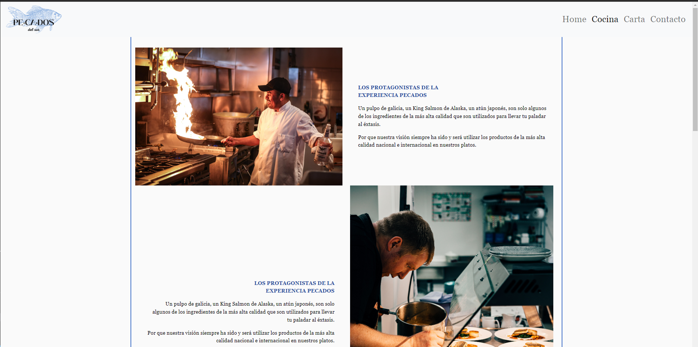

<h1 align="center">
Pecados del sur
</h1>

___
<h5 align="center">Página web de un restaurante para el Bootcamp FSD de GeeksHubs. Por José Carlos Núñez.</h5>

 

    <a href="#about">About</a> ·
    <a href="#usage">Usage</a> ·
    <a href="#features">Features</a>

___

## About

He creado la web, de un restaurante ficticio, basandome en varias webs de internet. El restaurante se llama Pecados del sur.
Inspirado en restaurantes de diseño y alta cocina.

 
 Vista Home

Esta compuesta de 4 apartados, Home, Cocina, Carta, y Contacto.
Las fotos han sido obtenidas de webs sin derechos de autor y descarga gratuita.

El logo, lo he realizado de manera manual a través de CANVA.

 
 Vista Home

---

## Usage

Se puede desplegar a través de Github pages.
La navegación es simple e intuitiva, solo debes clicar en el logo o en la parte superior derecha dependiendo de la página que quieras visitar.

---

## Features

* Todo el proyecto ha sido realizado con Bootstrap, HTML, y CSS.
* Responsive
* Logo realizado con CANVA.
* Imagenes extraidas en su mayoría de unsplash.com
